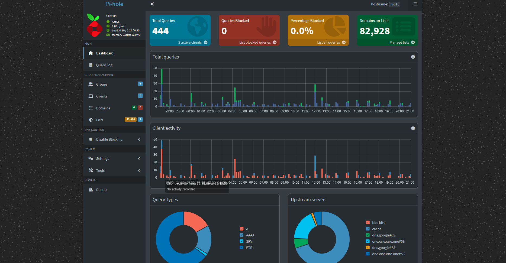
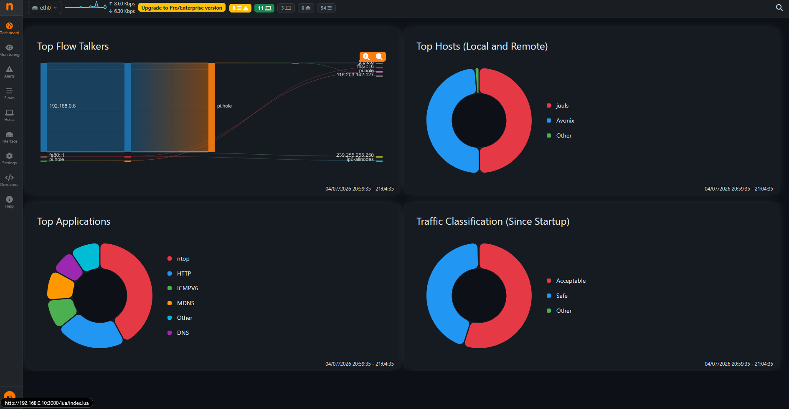

# Headless Network Gateway Security & Telemetry Engine

## 📌 Project Overview
An enterprise-aligned network infrastructure deployment engineered to maximize operational privacy, edge security, and real-time observability across a Local Area Network (LAN). Utilizing a headless Raspberry Pi architecture running Debian Trixie (64-bit), the system functions as a secure, network-wide authoritative DNS sinkhole to drop malicious domain vectors at the gateway, while concurrently operating a passive data-link layer probe executing Deep Packet Inspection (DPI) for granular traffic telemetry.

---

## 🗺️ System Architecture & Visual Topology
The deployment intercepts and observes local network traffic without altering upstream core routing tables by utilizing a twin-engine approach:

  

1. **Ingress DNS Filtering (Application Layer):** Intercepts client queries, matching targets against structured blocklists to neutralize tracking telemetry and malware distributions before external egress occurs.
2. **Passive Flow Analysis (Data Link Layer):** Leverages promiscuous mode packet capture bound to the core physical interface, extracting Layer-2 through Layer-7 protocols to baseline local network conversations.
---

## 🛠️ Core Infrastructure Stack
* **DNS Sinkholing (Pi-hole v6 Architecture):** Configured with centralized TOML specifications to handle upstream DNS forwarding and high-performance local query resolution.
* **Traffic Inspection & DPI (ntopng Platform):** Deployed as a passive network observation probe to map socket allocations, calculate bandwidth distribution profiles, and capture real-time application-layer traffic flows.

### Live Infrastructure Telemetry

  
  

---

## ⚙️ Engineering & Performance Optimization
* **Storage Lifecycle Preservation:** Tuned Linux kernel parameters by overriding `systemd-journald` policies (`Storage=volatile`, `RuntimeMaxUse=64M`) to keep system logs strictly in transient RAM, eliminating heavy disk I/O to preserve the physical micro-SD card lifecycle.
* **Network Interface & Service Isolation:** Resolved daemon conflict loops by systematically mapping web management control loops to distinct TCP socket bindings (`Port 80` for DNS management routing, `Port 3000` for deep-packet analytics engines).
* **Analytical Traffic Baselining:** Applied customized BPF (Berkeley Packet Filter) criteria (`"not multicast and not broadcast"`) to remove low-level background network chatter, leaving clean data sets for analysis.

---

## 📈 System Observations & Insights
* **Upstream Traffic Reduction:** Over a 48-hour tracking baseline, approximately **15% to 20%** of all outbound LAN DNS queries were systematically dropped at the edge, significantly reducing telemetry overhead.
* **Protocol Distribution:** Telemetry data exposed via the `ntopng` flow engine identified HTTPS (`TLS`) as the primary driver of outbound bandwidth, alongside persistent IoT background query intervals.
