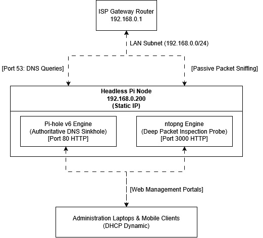

# Local Area Network (LAN) Engineering Specification

## 🗺️ Logical Network Topology Reference
Below is the architectural data flow map for this gateway deployment.



---

## 📊 IP Address Allocation & Interface Matrix
This matrix details the structural boundaries and static assignments configured within the local subnet area (`192.168.0.0/24`).

| Device Hostname | Physical Interface | MAC Address Reference | Assigned IP Address | Role / Functional Scope |
| :--- | :--- | :--- | :--- | :--- |
| `isp-gateway-router` | `WAN / LAN` | `AA:BB:CC:DD:EE:01` | `192.168.0.1` | Core DHCP Server & Upstream WAN Gateway |
| `headless-pi-node` | `eth0 (1000Base-T)` | `AA:BB:CC:DD:EE:02` | `192.168.0.200` | Authoritative DNS Sinkhole & DPI Traffic Probe |
| `engineering-laptop` | `wlan0 (802.11ax)` | `AA:BB:CC:DD:EE:03` | `DHCP Dynamic` | Primary Administration Workstation |
| `mobile-ipad-node` | `wlan0 (802.11ax)` | `AA:BB:CC:DD:EE:04` | `DHCP Dynamic` | Secondary Management Console |

---

## 🔌 Socket & Port Routing Architecture
To maintain high availability and mitigate interface port collision behaviors, local network services are isolated across the following structural sockets:

* **`192.168.0.200:53 (UDP/TCP)`** $\rightarrow$ **DNS Core Resolution:** Handles incoming network-wide client lookup queries.
* **`192.168.0.200:80 (TCP)`** $\rightarrow$ **Pi-hole v6 Admin Portal:** Restricted local HTTP route for gravity blocklist adjustments.
* **`192.168.0.200:3000 (TCP)`** $\rightarrow$ **ntopng Analytics Engine:** Dedicated socket interface rendering real-time deep-packet traffic flows.

---

## 📋 Berkeley Packet Filter (BPF) Criteria
To prevent analytics database exhaustion and streamline packet processing queues, the deep packet inspection engine executes filtering at the kernel level using the following operational string:

```text
not multicast and not broadcast and dst net 192.168.0.0/24
